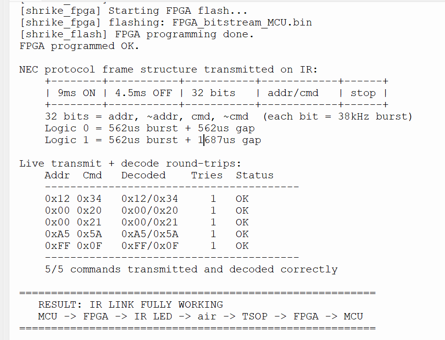
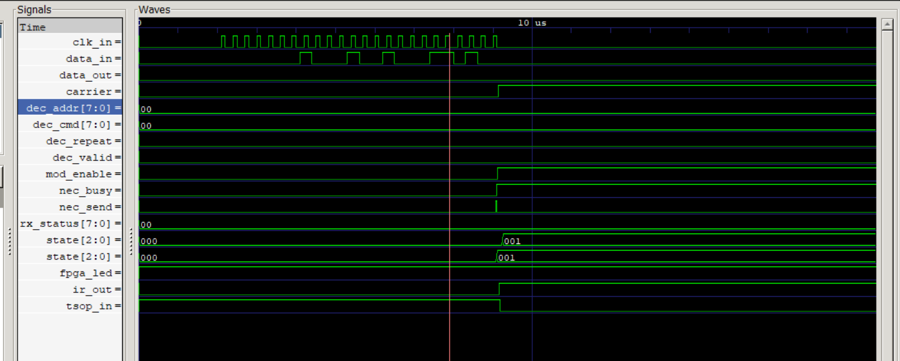
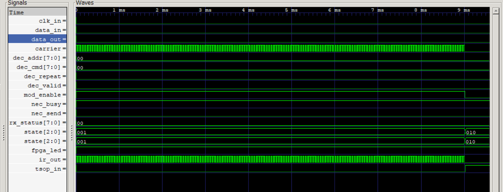
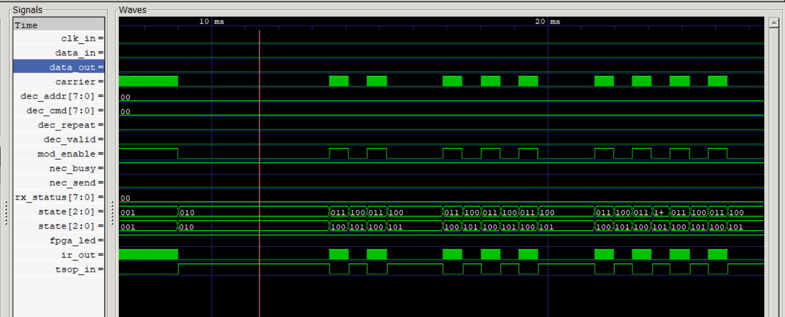
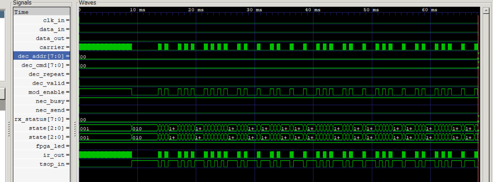
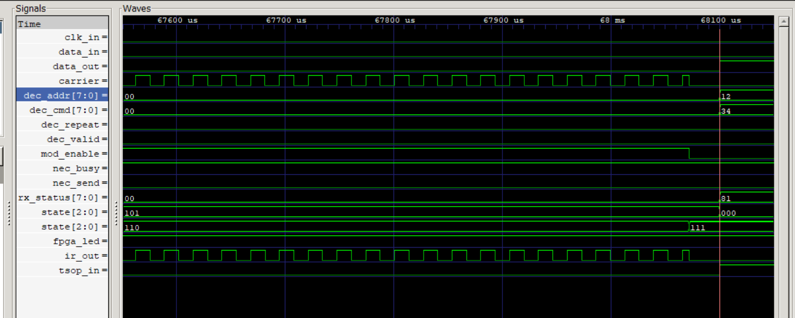

# IR Transmitter and Receiver

**Difficulty:** Intermediate

**Uses MCU:** Yes

**External Hardware:** IR LED, TSOP1738 (or compatible 38 kHz IR receiver), 220 Ω resistor, breadboard, jumper wires

## Overview

A complete NEC infrared transmitter and receiver built on the Shrike Lite board. All timing-critical work runs in the FPGA fabric: 38 kHz carrier generation, NEC frame encoding, and NEC frame decoding. The RP2040 only sends a 3-byte command and reads back a 3-byte result over a simple two-wire link.

A NEC frame is 32 bits: address, inverted address, command, inverted command which is modulated onto a 38 kHz carrier with a 9 ms leader. The FPGA produces this entirely in hardware, so the MCU side stays trivial.

```
RP2040  --2-wire-->  FPGA NEC encoder  -->  38 kHz carrier  -->  IR LED
                                                                    |
                                                                  (air)
                                                                    v
RP2040  <--2-wire--  FPGA NEC decoder  <--  TSOP1738  <-------------+
```

## Compatibility

| Board                | Firmware                    | Status      |
| -------------------- | --------------------------- | ----------- |
| Shrike-Lite (RP2040) | `firmware/micropython/`     | ✅ Tested    |
| Shrike (RP2350)      | `firmware/micropython/`     | ⬜ Untested  |
| Shrike-fi (ESP32-S3) | `firmware/micropython/`     | ⬜ Untested  |

> FPGA bitstream is the same across all boards.

## Hardware Setup

### Wiring

| Signal   | MCU Pin   | FPGA Pin   | Direction   | Notes                         |
| -------- | --------- | ---------- | ----------- | ----------------------------- |
| DATA     | GPIO5     | FPGA_IO0   | MCU → FPGA  | Command bits in               |
| CLOCK    | GPIO6     | FPGA_IO1   | MCU → FPGA  | Shared shift clock            |
| RETURN   | GPIO7     | FPGA_IO18  | FPGA → MCU  | Decoded result out            |
| IR LED   | —         | FPGA_IO7   | FPGA → LED  | 38 kHz modulated output       |
| TSOP OUT | —         | FPGA_IO8   | TSOP → FPGA | Demodulated NEC input (PMOD)  |
| FPGA LED | —         | GPIO16     | On-board    | Heartbeat / decode indicator  |

### IR LED Circuit

`FPGA_IO7 → 220 Ω → IR LED anode`, cathode to GND.

### TSOP1738 (dome facing you, pins down — GND, VCC, OUT)

`GND → GND`, `VCC → 3.3 V`, `OUT → FPGA_IO8`

> All Shrike I/O is 3.3 V. Confirm the exact pad assignments in `IR_PROJECT.ffpga` (IO Planner) before wiring.

## Quick Start (Pre-Built Bitstream)

1. Connect your Shrike board via USB
2. Copy `bitstream/FPGA_bitstream_MCU.bin` and `firmware/micropython/demo.py` to the RP2040
3. Run `demo.py` in Thonny
4. Point the IR LED at the TSOP from a few centimetres away

> Too close saturates the TSOP, too far drops the signal.

## Build From Source

### FPGA (Verilog)

1. Open `IR_PROJECT.ffpga` in Go Configure Software Hub
2. Set the IO Planner to the pins in the wiring table
3. Click **Synthesize → Generate Bitstream**
4. Flash from MicroPython with `shrike.flash("FPGA_bitstream_MCU.bin")`

### Firmware

1. Open `demo.py` in Thonny
2. Select MicroPython interpreter (RP2040)
3. Run the script

## How It Works

### Two-Wire Protocol

**MCU → FPGA (send a command).** The MCU shifts 24 bits MSB first, toggling DATA then pulsing CLOCK for each bit:

| Byte | Meaning                                    |
| ---- | ------------------------------------------ |
| 0    | Type — `0x01` = data frame, `0x02` = repeat |
| 1    | Address                                    |
| 2    | Command                                    |

**FPGA → MCU (read a result).** After a frame is decoded from the TSOP, the FPGA drives RETURN high and presents a 24-bit result:

| Byte | Meaning                                                          |
| ---- | ---------------------------------------------------------------- |
| 0    | Status — `0x81` = valid data, `0x82` = repeat, `0x00` = nothing |
| 1    | Decoded address                                                  |
| 2    | Decoded command                                                  |

### FPGA Design (`ffpga/src`)

| File                  | Role                                                            |
| --------------------- | --------------------------------------------------------------- |
| `modulator.v`         | Top module — link, command parser, result serializer             |
| `nec_encoder.v`       | NEC frame state machine (leader, 32 bits, stop, repeat, gap)    |
| `carrier_generator.v` | 38 kHz carrier (counter = 661 for the measured 50.33 MHz clock) |
| `nec_decoder.v`       | NEC decoder with timing windows and glitch rejection            |

## Expected Output

Running `demo.py` on hardware:

```
Live transmit + decode round-trips:
    Addr  Cmd   Decoded    Tries  Status
    ----------------------------------------
    0x12 0x34   0x12/0x34     1   OK
    0x00 0x20   0x00/0x20     1   OK
    0x00 0x21   0x00/0x21     1   OK
    0xA5 0x5A   0xA5/0x5A     1   OK
    0xFF 0x0F   0xFF/0x0F     1   OK
    ----------------------------------------
    5/5 commands transmitted and decoded correctly
```



## Simulation

The full encode → loopback → decode path can be verified with Icarus Verilog:

```bash
cd ffpga/sim
iverilog -o tb_ir_loopback.vvp tb_ir_loopback.v
vvp tb_ir_loopback.vvp
gtkwave tb_ir_loopback.vcd
```

Expected output:

```
[2000000] Sending NEC command: type=0x01 addr=0x12 cmd=0x34
[68099690000] DECODED  addr=0x12  cmd=0x34
RESULT: PASS  (loopback decode matches transmitted frame)
```

## Waveforms

| Waveform | Description |
| -------- | ----------- |
|  | Command shifted in, NEC leader burst starts |
|  | Full 9 ms leader mark — solid 38 kHz burst |
|  | 32-bit payload using pulse-distance coding |
|  | Whole frame — leader, 32 bits, stop, gap |
|  | Decode success — `addr=0x12`, `cmd=0x34` |

## File Structure

```
IR_Transmitter_Receiver/
├── IR_PROJECT.ffpga              # Shrike project file
├── bitstream/
│   └── FPGA_bitstream_MCU.bin    # Compiled bitstream
├── ffpga/
│   ├── src/                      # Verilog sources
│   └── sim/                      # Testbenches
├── firmware/micropython/         # RP2040 scripts
├── images/                       # Waveforms / diagrams
└── README.md
```
